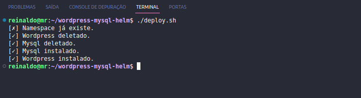
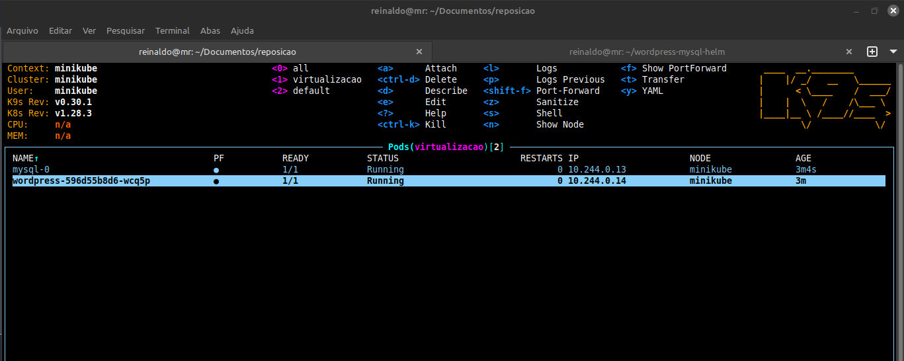
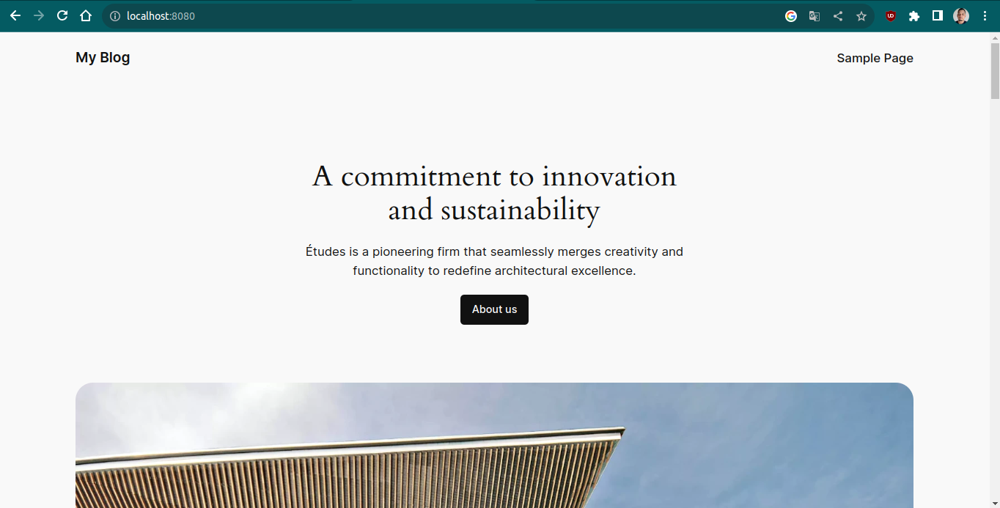
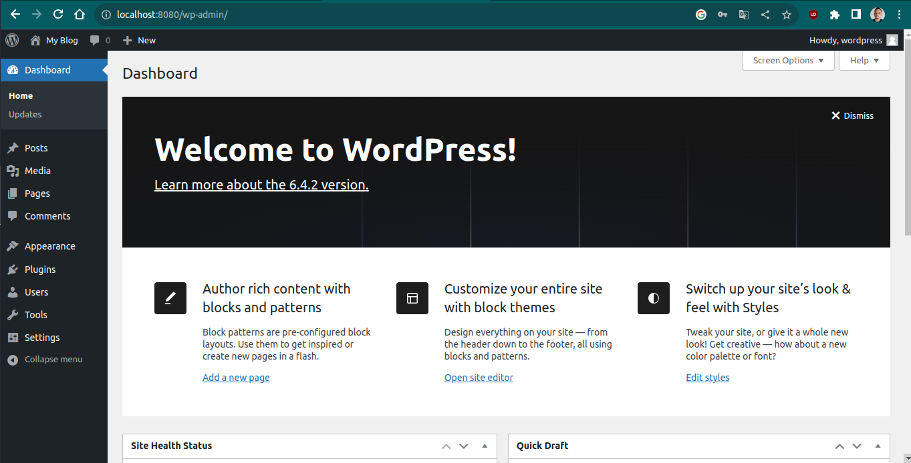

# wordpress-mysql-helm

Deploy do Wordpress com MySQL

## Screenshots

### Script de deploy do ambiente

### K9S - Dashboard Mostrando os pods

### Listando tudo dentro do namespace 'virtualizacao'

### Aplicando Port-Forward para acessar o Wordpress

### Acessando o Wordpress

### Página Administrativa do Wordpress

